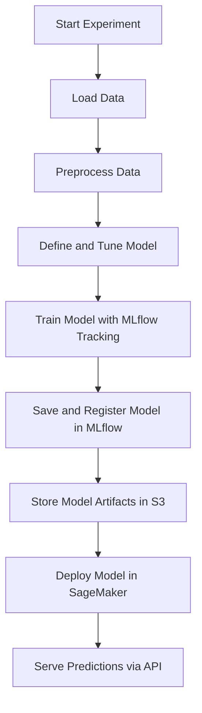

# MLflow with AWS SageMaker

## Overview
This guide explains how to use MLflow with AWS to track experiments, register models, and deploy them using SageMaker. It details the necessary AWS configurations, storage considerations, and provides a step-by-step workflow.

## AWS Considerations
Using MLflow with AWS requires configuring:

1. **AWS S3 Bucket**: Stores MLflow artifacts such as model files and logs.
2. **AWS SageMaker**: Hosts and serves the trained model.
3. **MLflow Tracking Server**: Logs experiments and stores metadata.
4. **IAM Roles**: Ensures proper access control for MLflow and SageMaker services.

## Prerequisites
Before running MLflow on AWS:
- Install AWS CLI and configure credentials:
  ```bash
  aws configure
  ```
- Ensure you have a SageMaker execution role with permissions for S3 and MLflow.
- Set up an S3 bucket for MLflow artifacts.

## Configuring MLflow with AWS
1. **Set up MLflow Tracking URI with an S3 artifact store:**
   ```python
   mlflow.set_tracking_uri("http://your-mlflow-server:5000")
   mlflow.set_experiment("AWS_MLflow_TimeSeries")
   ```

2. **Configure MLflow to log artifacts in S3:**
   ```python
   mlflow.log_artifact("/path/to/local/artifact", artifact_path="s3://your-bucket/mlflow-artifacts")
   ```

3. **Deploying Model to SageMaker:**
   ```python
   import mlflow.sagemaker
   
   model_uri = "runs:/your_run_id/lstm_model"
   region = "us-east-1"
   image_uri = "763104351884.dkr.ecr.us-east-1.amazonaws.com/tensorflow-inference:2.6.0-cpu"
   role_arn = "arn:aws:iam::your-account-id:role/SageMakerExecutionRole"
   
   mlflow.sagemaker.deploy(
       app_name="lstm-model-service",
       model_uri=model_uri,
       region_name=region,
       image_url=image_uri,
       execution_role_arn=role_arn,
       instance_type="ml.m5.large",
       sagemaker_session=None
   )
   ```

## MLflow Workflow in AWS SageMaker


## Best Practices
- Use **S3 versioning** to manage model iterations.
- Set up **CloudWatch** to monitor SageMaker deployments.
- Automate training and deployment with **AWS Lambda** or **Step Functions**.
