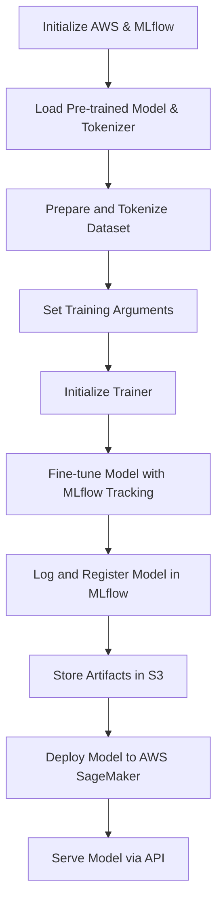

# LLMOps with MLflow on AWS

## Overview
This guide provides a detailed approach to implementing **Large Language Model Operations (LLMOps)** using MLflow on AWS. It covers setting up the environment, fine-tuning a transformer-based model, tracking experiments, and deploying the model using SageMaker.

## Prerequisites
Before proceeding, ensure you have:
- **AWS Account** with necessary permissions.
- **AWS CLI** installed and configured:
  ```bash
  aws configure
  ```
- **Python 3.7+** installed.
- **MLflow** installed:
  ```bash
  pip install mlflow
  ```
- **Hugging Face Transformers** for model handling:
  ```bash
  pip install transformers
  ```
- **SageMaker Execution Role** with access to S3 and MLflow services.

## AWS Setup
1. **Create an S3 bucket** to store MLflow artifacts:
   ```bash
   aws s3 mb s3://mlflow-artifacts-bucket
   ```
2. **Launch an MLflow Tracking Server** on an EC2 instance or use SageMaker.
3. **Assign IAM roles** for the MLflow Tracking Server to interact with S3.

## Implementing LLMOps with MLflow
This Python script demonstrates how to fine-tune a **GPT-2 model** using MLflow and AWS.

```python
import os
import mlflow
import torch
from transformers import AutoModelForCausalLM, AutoTokenizer, Trainer, TrainingArguments, TextDataset, DataCollatorForLanguageModeling
import mlflow.sagemaker

# AWS and MLflow Configurations
s3_bucket = 'your-mlflow-artifacts-bucket'
region_name = 'us-east-1'
os.environ['MLFLOW_S3_ENDPOINT_URL'] = f'https://s3.{region_name}.amazonaws.com'
mlflow.set_tracking_uri(f'http://your-mlflow-tracking-server')

# Load Pre-trained Model
tokenizer = AutoTokenizer.from_pretrained('gpt4o')
model = AutoModelForCausalLM.from_pretrained('gpt4o')

# Prepare Dataset
def load_dataset(file_path, tokenizer, block_size=128):
    return TextDataset(tokenizer=tokenizer, file_path=file_path, block_size=block_size)

train_dataset = load_dataset('path_to_training_data.txt', tokenizer=tokenizer)
data_collator = DataCollatorForLanguageModeling(tokenizer=tokenizer, mlm=False)

# Training Configuration
training_args = TrainingArguments(
    output_dir='./results',
    num_train_epochs=3,
    per_device_train_batch_size=4,
    save_steps=10_000,
    logging_dir='./logs',
)

trainer = Trainer(
    model=model,
    args=training_args,
    data_collator=data_collator,
    train_dataset=train_dataset,
    tokenizer=tokenizer,
)

# MLflow Tracking
with mlflow.start_run() as run:
    trainer.train()
    trainer.save_model("model")
    mlflow.log_artifacts("model", artifact_path="model")
    mlflow.pytorch.log_model(model, "model", registered_model_name="GPT-2-Finetuned")
```

## Deploying the Model to AWS SageMaker
```python


app_name = "gpt40-finetuned"
model_uri = f"runs:/{run.info.run_id}/model"
image_uri = "763104351884.dkr.ecr.us-east-1.amazonaws.com/pytorch-inference:1.9.0-cpu-py38-ubuntu20.04"
role_arn = "arn:aws:iam::your-account-id:role/sagemaker-role"

mlflow.sagemaker.deploy(
    app_name=app_name,
    model_uri=model_uri,
    region_name=region_name,
    mode="create",
    execution_role_arn=role_arn,
    image_url=image_uri,
    instance_type="ml.m5.large",
    s3_bucket=s3_bucket,
    timeout_seconds=3600,
    synchronous=True
)
```

## LLMOps Workflow



